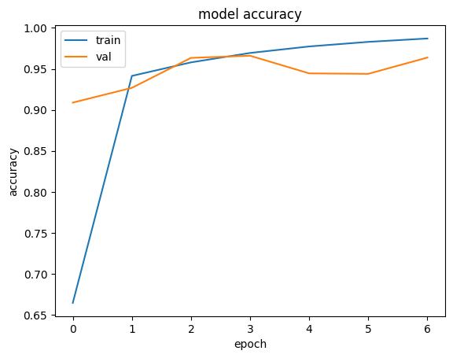

# <b>Netra scan</b> - <em>Deep learning Project</em>

## Introduction
Netra-Scan is a web-based application that leverages deep learning to detect various retinal diseases such as DME, Drusen, Normal, and CNV. The project utilizes a tailored Convolutional Neural Network (CNN) model based on Xception architecture to analyze and predict retinal conditions.

## Installation And Usage
Clone the repo and then change only the absolute path with your absolute file path

The model used in this project [Model](https://drive.google.com/file/d/1B1_69SoFT0V92fbp_7dS_aUdQoOQ2vdU/view?usp=drive_link) which has a accuracy of more than 95%

